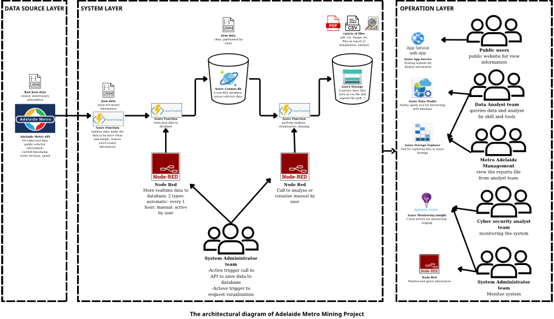
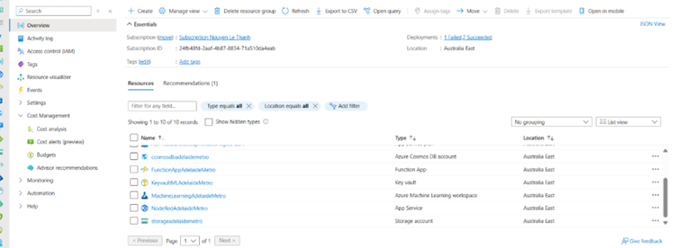
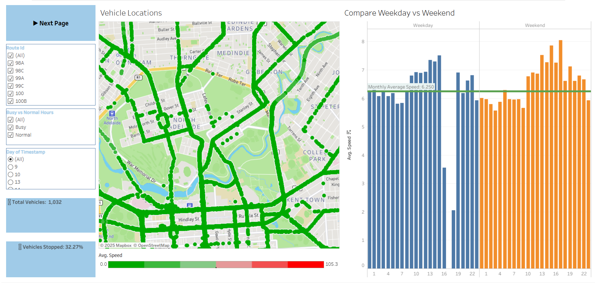
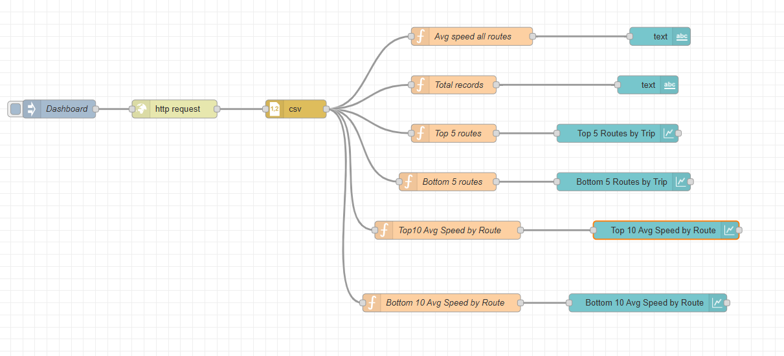
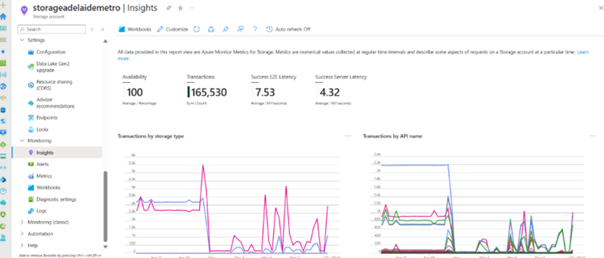
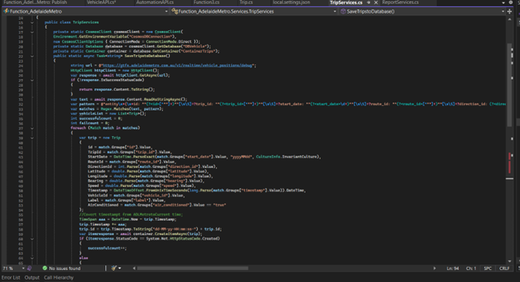

# Adelaide Metro Real-Time Data Mining Platform | Cloud Computing Project

## Description

This project was developed as part of a **Cloud and Distributed Computing course at Flinders University**.
The system designs and implements a **cloud-based data pipeline** to collect, process, store, and analyse real-time public transport data from the **Adelaide Metro API**.

The solution integrates **Microsoft Azure cloud services and Node-RED** to automate data ingestion, monitoring, reporting, and visualization, allowing stakeholders to track vehicle locations and analyse transport operations in real time.

*Figure 1: System architecture overview*

---

## Key Features

* Designed a **cloud-based architecture** to collect and process real-time vehicle data from the Adelaide Metro public API.
* Implemented **serverless backend APIs using Azure Functions** to retrieve, clean, and transform JSON transport data.
* Stored real-time and historical vehicle data using **Azure Cosmos DB (NoSQL)** for scalable and efficient data queries.
* Developed automated workflows using **Node-RED** to trigger data collection, monitoring, and reporting tasks.
* Built **data visualization dashboards** using Node-RED and Tableau for analysing transport operations.
* Developed a **web application for public users** to view real-time vehicle locations and route information.
* Implemented **automatic alert notifications** for abnormal transport conditions.

---

## System Architecture

The system follows a distributed cloud architecture consisting of **data ingestion, processing, storage, and analytics layers**.

Key components include:

* **Data Source:** Adelaide Metro Real-time API
* **Processing Layer:** Azure Functions
* **Storage Layer:** Azure Cosmos DB and Azure Storage
* **Middleware:** Node-RED automation workflows
* **Analytics Layer:** Tableau dashboards
* **Web Interface:** Azure App Service

*Figure 2: Overall cloud services*

---

## Technologies Used

**Cloud Platform**

* Microsoft Azure

**Azure Services**

* Azure Functions
* Azure Cosmos DB
* Azure Storage
* Azure Application Insights
* Azure App Service

**Development Tools**

* Visual Studio 2022
* Postman
* Azure Data Studio
* Azure Storage Explorer

**Data Processing & Integration**

* Node-RED
* REST APIs
* JSON Data Processing

**Data Visualization**

* Tableau
* Node-RED Dashboard

*Figure 3: Tableau dashboard for transport analytics*

*Figure 4: Node-RED / quick visualization*

---

## Example Implementation

### Real-Time Data Storage using Azure Cosmos DB

*Figure 5: Azure Storage / Cosmos DB*

---

### Backend API Development

Backend APIs were implemented using **Azure Functions** to retrieve and process real-time vehicle data from the Adelaide Metro API.

*Figure 6: IDE – solving the Adelaide Metro API*

---

## Learning Outcomes

Through this project, the following skills were developed:

* Designing **cloud-native and distributed system architectures**
* Implementing **serverless applications using Azure**
* Building **real-time data processing pipelines**
* Integrating **public APIs with cloud-based analytics platforms**
* Developing **data visualization dashboards and monitoring tools**

---

**Full project report:** [LeThanhNguyen_Cloudcomputing_Project.pdf](https://drive.google.com/file/d/12E44juVm0CFiSQ5SwKjy9VYUaUarlHmM/view?usp=sharing)
