# Project: Machine Learning for Electroluminescence (EL) Defect Detection in Solar Panels

## Introduction

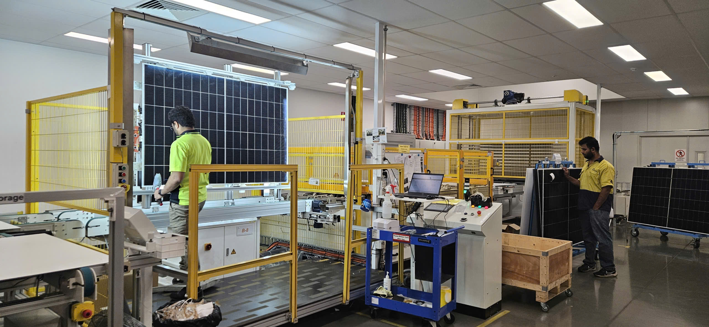

While working at Tido Solar as a machine operator, I had the opportunity to participate in a project focused on detecting defects in solar panels using Electroluminescence (EL) imaging.

**Electroluminescence (EL)** is a non-destructive testing method in which an electrical current is applied to a solar panel, causing its cells to emit infrared light. This emission is captured by a specialised camera, allowing internal defects to be identified even when they are not visible.

EL imaging can reveal several types of defects, with the most common being:
- **Cracks**: affecting performance and durability  
- **Soldering issues**: disrupting electrical connections  
- **Scratches**: degrading surface quality and efficiency  

  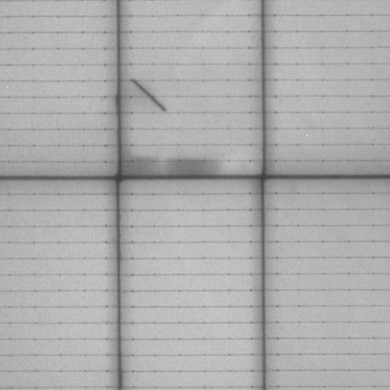
  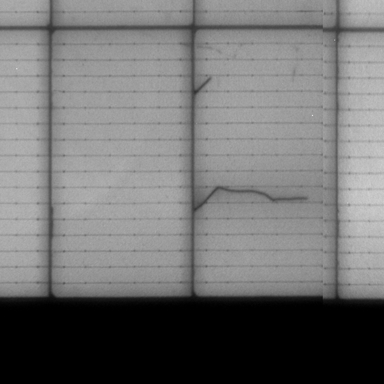
  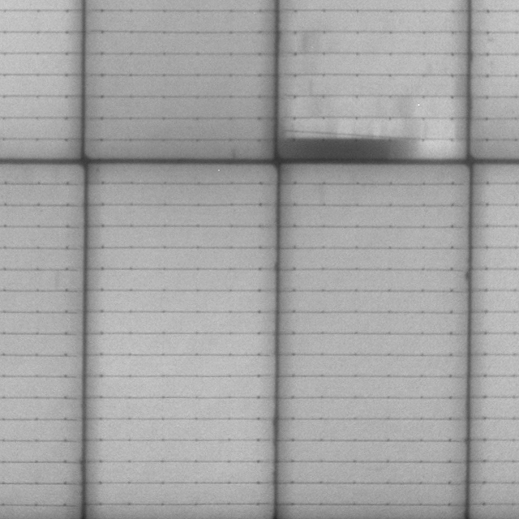

  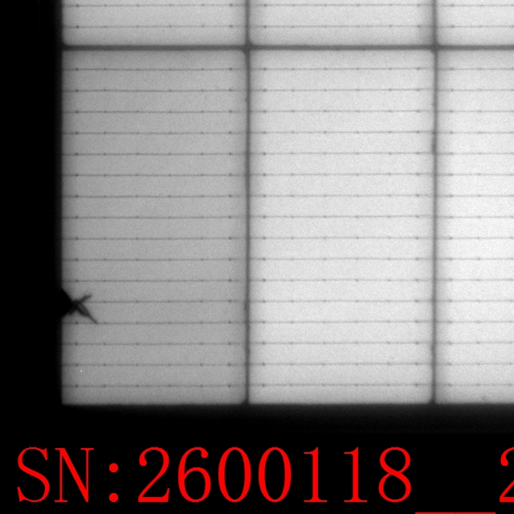
  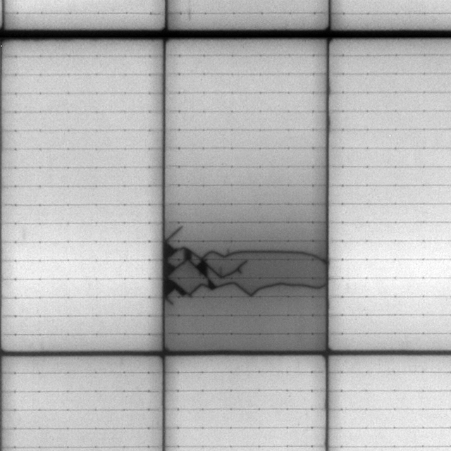
  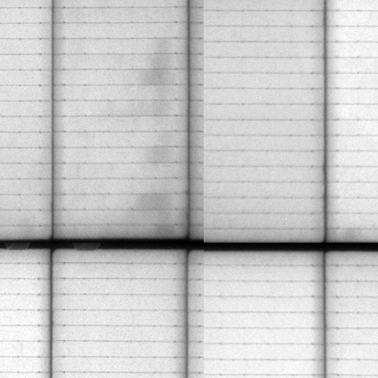

In practice, the inspection process heavily relies on human observation, requiring technicians to analyse hundreds of images daily. This approach is time-consuming and prone to errors due to subjectivity and fatigue.

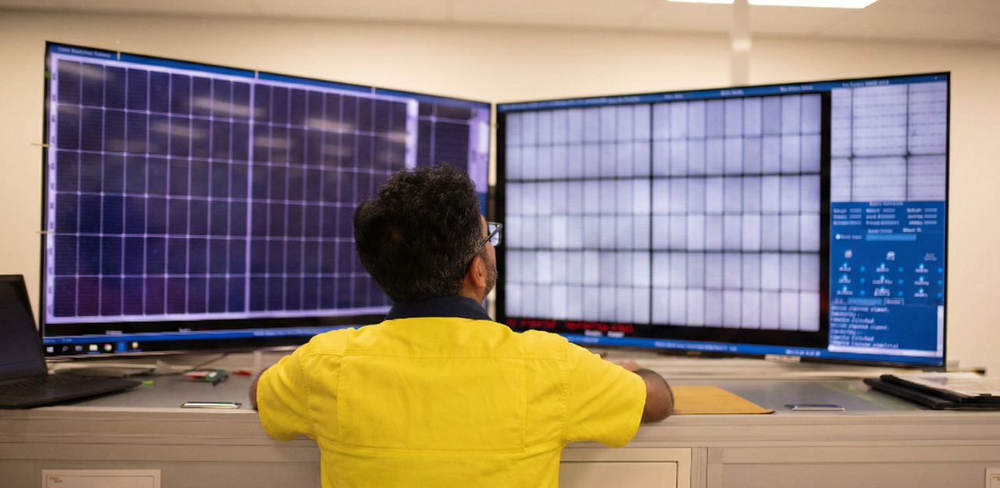

To address these limitations, a machine learning–based solution was proposed to automate defect detection from EL images. The goal is to develop a model capable of accurately and efficiently identifying defects, thereby reducing inspection time, improving productivity, and supporting technicians in decision-making.

This project demonstrates the potential of applying artificial intelligence to enhance quality inspection processes in industrial environments.

---

## System Architecture and Implementation

The project is organized into two main phases: the training phase and the implementation phase, forming a complete pipeline from data preparation to real-world deployment.

*Overal diagram of training phase and implementation phase*

### 1. Training Phase

The training phase focuses on preparing data and building the machine learning model:

*Training workflow: from data, labeling, and data augmentation to model training.*

- **Data Acquisition & Preprocessing**  
  High-resolution EL images (e.g., 5336×10856 and 4796×2868 pixels) were captured from EL inspection machines. These images were divided into smaller patches of 640×640 pixels to match model input requirements.

- **Data Annotation**  
  Technicians manually reviewed images and annotated defect regions using bounding boxes. Each defect was labeled with a class (crack, soldering issue, scratch).

- **Data Augmentation**  
  Techniques such as rotation (90°, 180°), flipping, and blurring were applied to improve dataset diversity and model generalization.

- **Dataset Splitting**  
  The dataset was split into 80% training and 20% validation sets. A YAML file was created for configuration.

- **Model Training**  
  The model was trained using YOLOv11 small version with Python, Visual Studio Code, and Google Colab.

*Using Visual Studio Code for training process.*

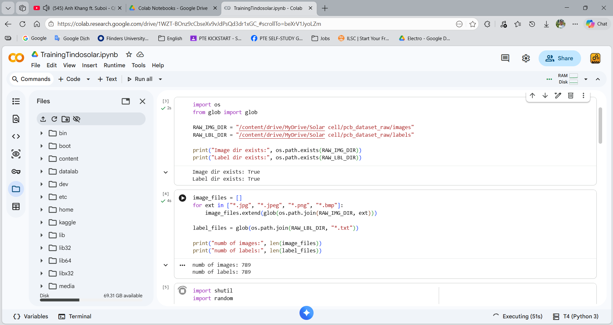

*Using Google Colab for training process: storing data in Google Drive.*

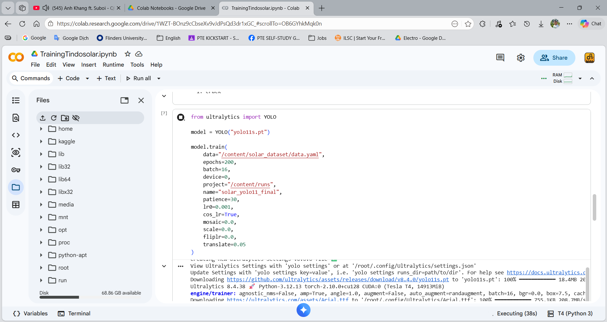

*Using Google Colab for training process: Setup the model and configuration before training.*

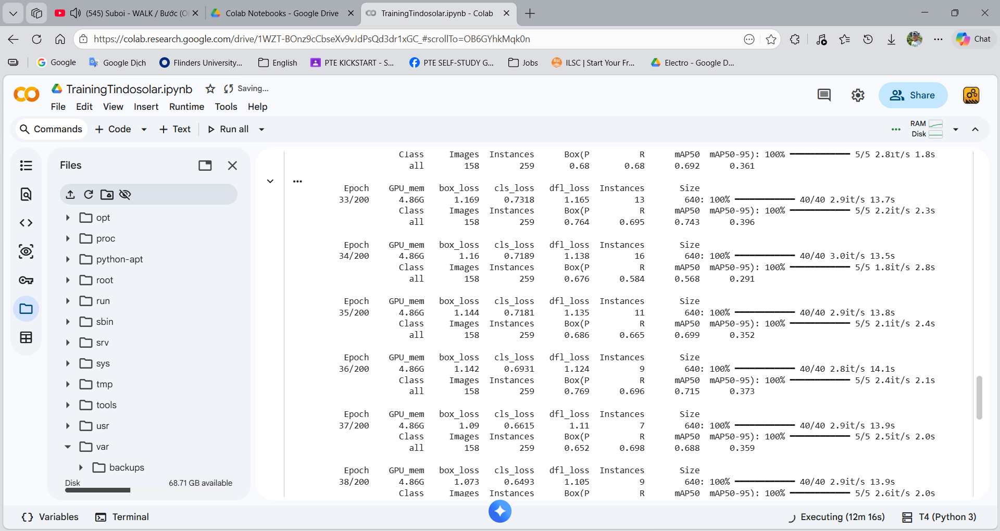

*Using Google Colab for training process: Monitoring training process.*

- **Model Output**  
  The trained model weights were saved locally for deployment.

  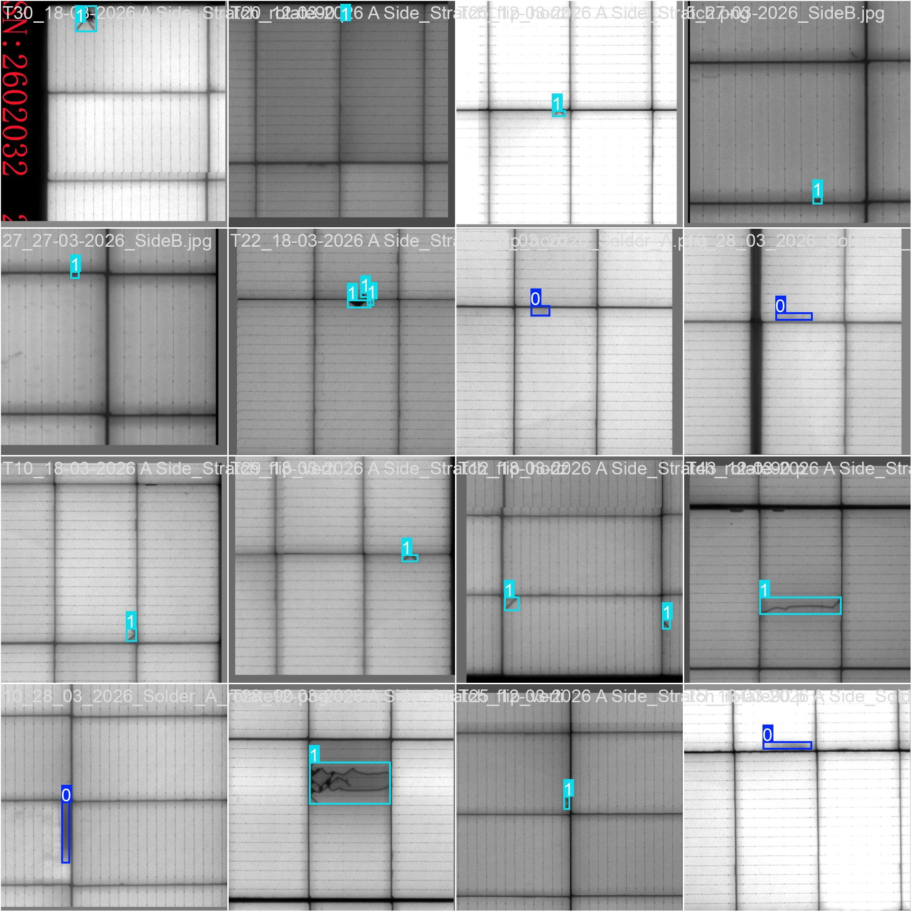
  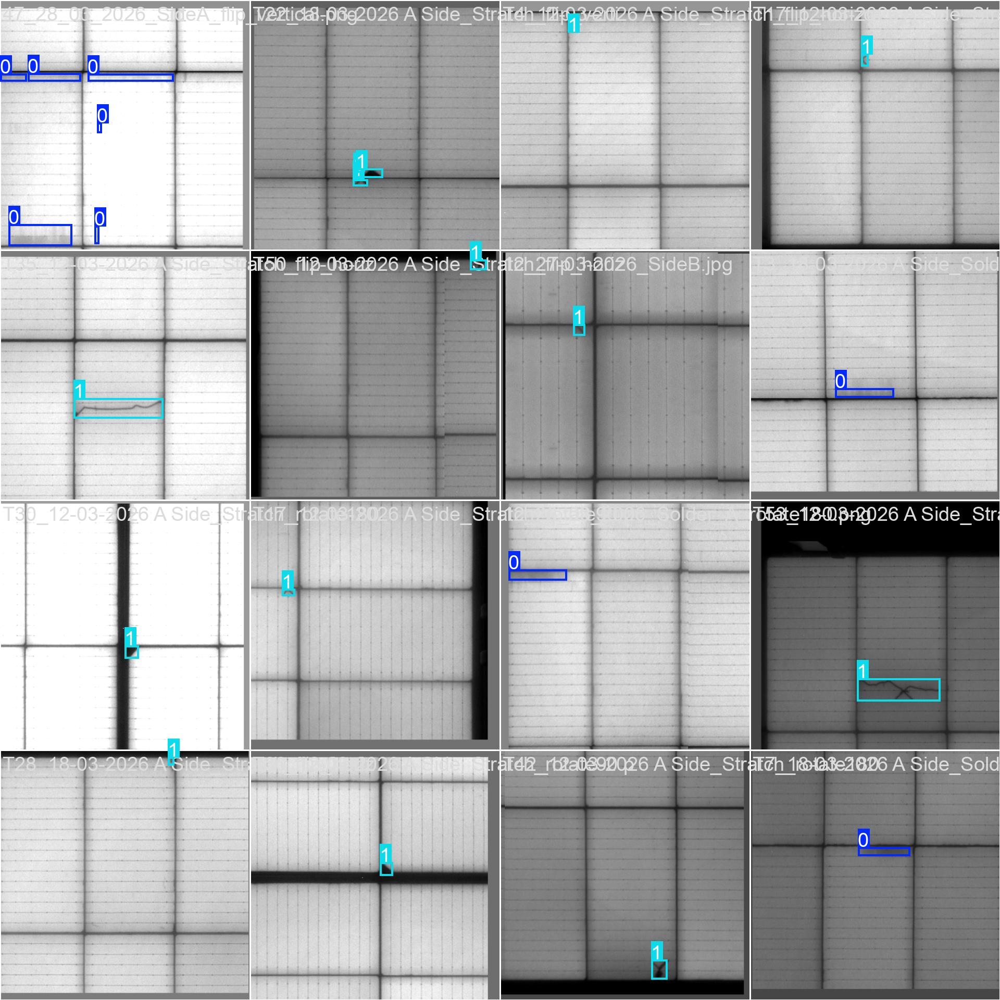
  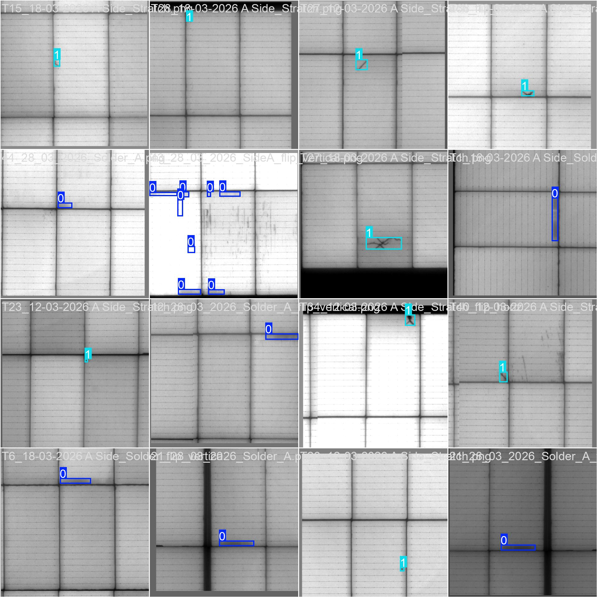

*Training Batches — Augmented image batches (Mosaic, flip, HSV) used for training.*

---

### 2. Implementation Phase

This phase focuses on deploying the trained model into the production environment:

- **API Development**

*API pipeline: split images into patches, run model inference, return JSON results.*

  1. Input images are split into 640×640 patches and stored in memory using Pillow library for image reading, cropping, drawing bounding boxes
  2. The trained model detects defects on each patch  
  3. Results are returned in JSON format (bounding box + class + confidence)

- **Visualization**  
  Detected defects are displayed by drawing bounding boxes and labels on the original image.

- **System Integration**  
  The API is integrated into the production line. Each EL scan automatically triggers defect detection.

- **Human-in-the-loop Verification**  
  The AI system supports technicians, who still perform manual verification.

- **Continuous Improvement**  
  New or misclassified samples are stored for future retraining to improve the model.

---

## Prototype Results

### [Click here to watch video demo — Part 1](https://www.youtube.com/watch?v=Hc9porv3HWE)

### [Click here to watch video demo — Part 2](https://www.youtube.com/watch?v=0seR3bU4ErQ)

### Application Interface

*Graphic User interface for detecting.*

  
  

*Graphic User interface: changing confidence value and results.*

*V Scratch issue was detected*

*Single Scratch issue was detected*

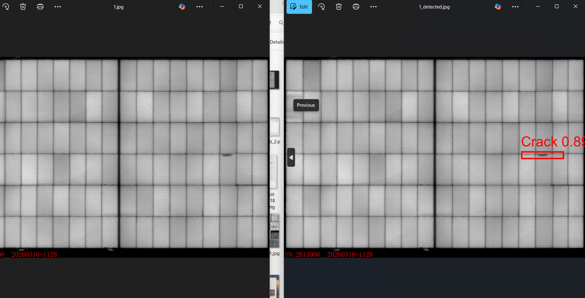

*Solder issues was detected and marked by red rectangle*

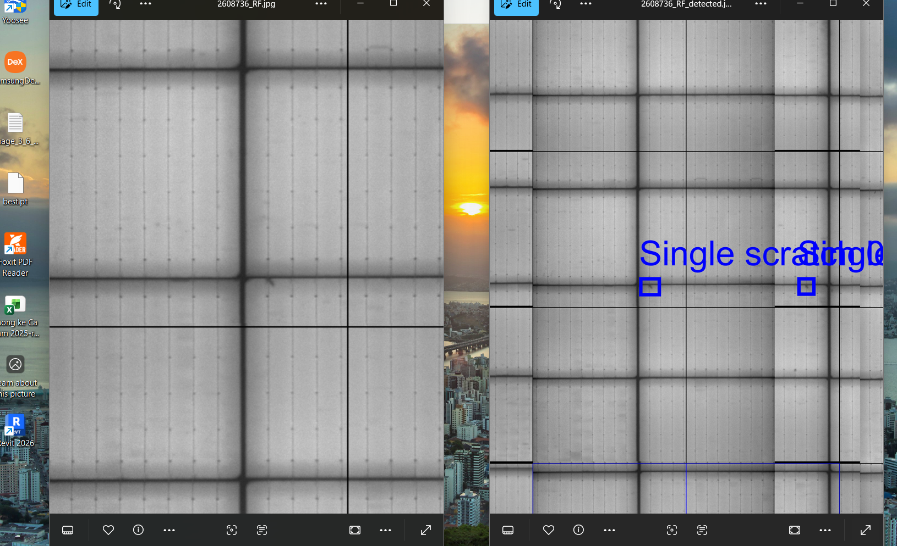

*Scratch issues was detected and marked by blue rectangle*

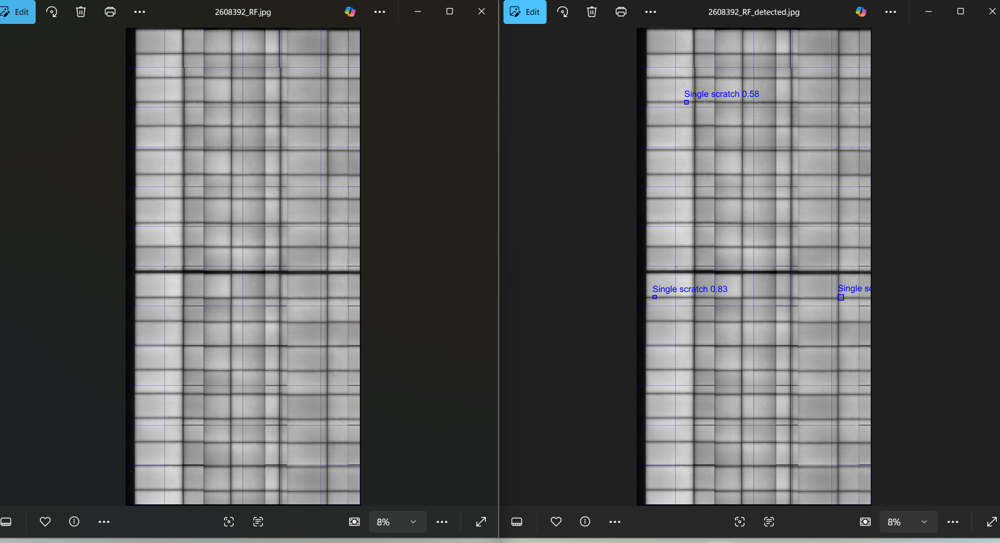

*Issues were detected and marked through the trained model*

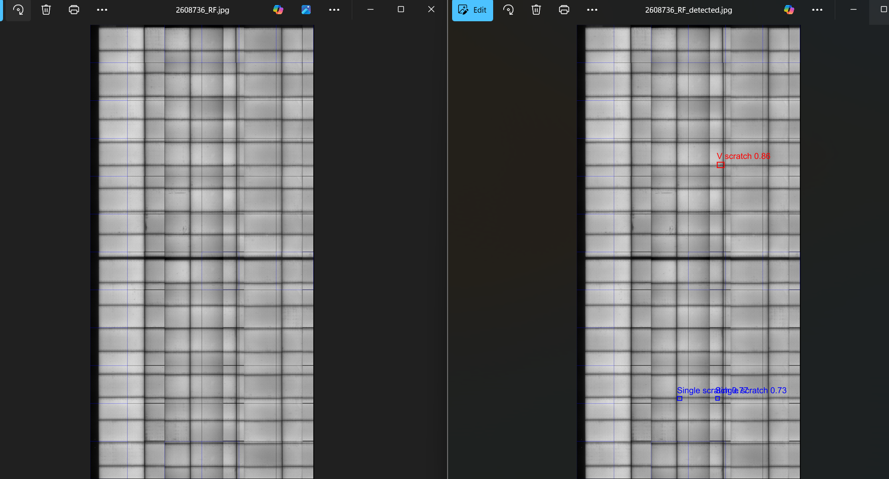

*Different issues were detected as red and blue color*

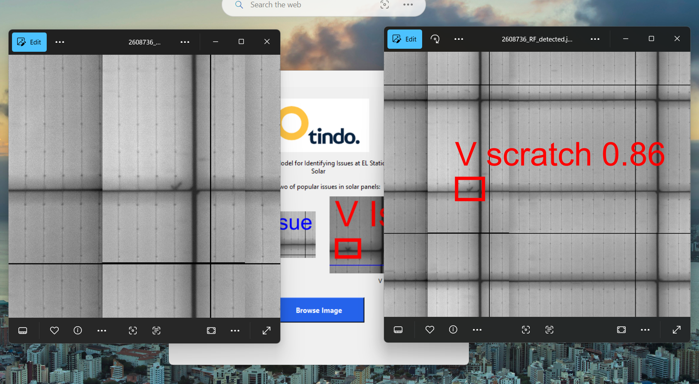

*The confidence 0.85 which is more accuracy*

---

## Conclusion

The project has successfully achieved initial results in detecting common defects in solar panels using EL images. We also developed a basic graphic UI to evaluate model performance by adjusting confidence thresholds ranging from 0.5 to 0.9 for analysis. The results demonstrate the feasibility of applying machine learning to support defect inspection in production.

The project is still ongoing, with further improvements expected in terms of accuracy, robustness, and real-world integration. Future work will focus on enhancing the model and expanding the dataset to achieve better performance and reliability.
