# Smart Retail — Mini Sales Management System

**Desktop application for small retail businesses: point-of-sale, table service, transactions, and reporting.**

---

## Overview

**Smart Retail** is a Windows desktop application for managing sales, inventory, and finances in small shops, cafes, and retail stores. It supports two user roles (employee and shop owner), table-based ordering, income/expense tracking, and export to Excel. Data is stored in a password-protected Excel file, so no separate database server is required.

---

## Key Features

| Module | Description |
|--------|-------------|
| **Login** | Role-based access: Employee (sales only) and Shop owner (full management). Optional manager password. |
| **Sales** | Create orders, add products to cart, set unit price and quantity, checkout and print invoice. |
| **Table service** | Manage multiple tables/orders (e.g. cafe, restaurant). Create tables, open orders, save draft, checkout per table. |
| **Purchase (stock-in)** | Record purchase transactions and link to inventory. |
| **Store settings** | Configure shop name, address, phone, introduction, and owner password. |
| **Product catalog** | Add/remove products (name, unit price). Bulk import/export via Excel template. |
| **Transaction management** | List all income/expense transactions, filter by date (today, week, month), search by keyword. View totals: revenue, expenses, profit (overall and from sales). |
| **Reports** | Export to Excel: financial summary, sales detail by product, inventory (import/export/stock). |
| **Invoice** | Print receipt/invoice with shop info, customer, time, line items, and total (DevExpress XtraReports). |
| **Activation** | First-run setup: store info and activation code. Optional 30-day trial. |

---

## Technology Stack

| Category | Technology |
|----------|------------|
| **Language** | C# |
| **Framework** | .NET Framework 4.7.2 |
| **UI** | Windows Forms, **DevExpress** (XtraEditors, XtraGrid, XtraLayout, XtraReports, XtraNavBar) |
| **Data storage** | **EPPlus** — Excel (.xlsx) as database (password-protected) |
| **Serialization** | **Newtonsoft.Json** (e.g. order details, table state) |
| **Reports** | DevExpress XtraReports (invoice layout and print preview) |

---

## Project Structure

```
PM_BanHangMini/
├── UI/                    # Forms and screens
│   ├── FormLogin          # Login (employee / shop owner)
│   ├── FormQuanLy         # Main form: Sales, Table service, Store settings, Transactions
│   ├── FormBanQuan        # Table order / POS for one table
│   ├── FormBegin          # First-run setup and activation
│   ├── FormKichHoat       # Activation (registration + code)
│   └── AboutUsForm        # About / product info
├── OBJECT/                 # Domain models and in-memory state
│   ├── DATACLIENT         # Static data (lists, current shop, current order)
│   ├── HangHoa            # Product (id, name, unit price, quantity, total)
│   ├── GiaoDich           # Transaction (time, type, amount, content, note)
│   ├── DonHang            # Order (customer, contact, items as JSON)
│   └── ThongTinShop       # Shop (name, address, phone, intro, password)
├── CONTROL/                # Business logic and helpers
│   └── XuLy               # Init DB, currency format, load/save Excel data
├── REPORT/                 # Printed output
│   └── ReportHoaDon       # Invoice report (DevExpress)
└── Program.cs              # Entry point, Excel license, startup init
```

---

## Data Model (Excel as database)

| Sheet (Excel) | Model (English) | Fields |
|---------------|-----------------|--------|
| **THONGTINSHOP** | ShopInfo | Shop name, address, phone, introduction, password, trial flag |
| **HANGHOA** | Product | Product ID, name, unit price |
| **GIAODICH** | Transaction | Transaction ID, time, income/expense, amount, content, note |
| **BANQUAN** | TableOrder | Table order ID, order JSON (for table-service mode) |

Data is read/written via EPPlus with a fixed password; no SQL server required.

---

## Highlights Keys
- **Full desktop lifecycle**: login, main dashboard, multiple workflows (sales, tables, settings, reports).
- **Role-based UI**: different permissions for employee vs shop owner (e.g. no delete transaction, no store edit for employee).
- **Excel as backend**: design of sheet layout, secure read/write, and initialization on first run.
- **Rich UI**: DevExpress grids, layout controls, galleries (tables), and printable reports.
- **Export and reporting**: multi-sheet Excel (financial, sales detail, inventory) and formatted invoice.
- **Localization-ready**: UI and reports use English (currency $, labels, messages); structure allows further localization.
- **Activation flow**: registration number, verification code, and optional trial period for distribution scenarios.

---

## Impact & Achievements

**Timeline:**
- **Jul 2021** — Project completed and released in Vietnamese version.
- **Aug 2025** — Translated to English version.

**Traction:**
- **100+ downloads** from Vietnam since released.
- **2 active customers** currently using in Adelaide, Australia.

---

## Screenshots

### Login — Role selection

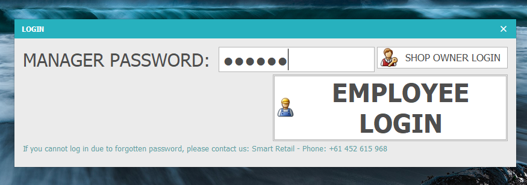

*Login screen: shop owner password or employee login.*

---

### Sales — Products, cart & checkout

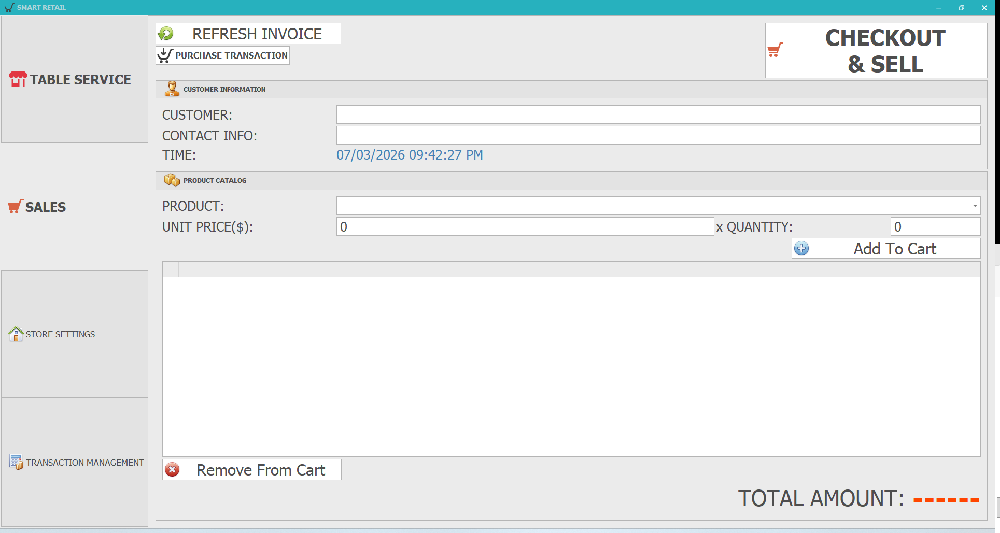

*Sales tab: initial view with empty cart, product catalog, customer info.*

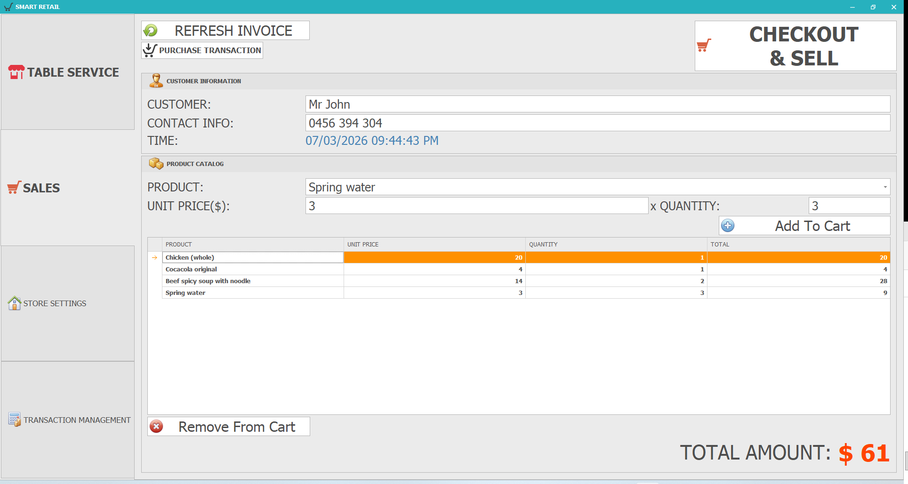

*Sales tab: customer info, product catalog, cart and total amount.*

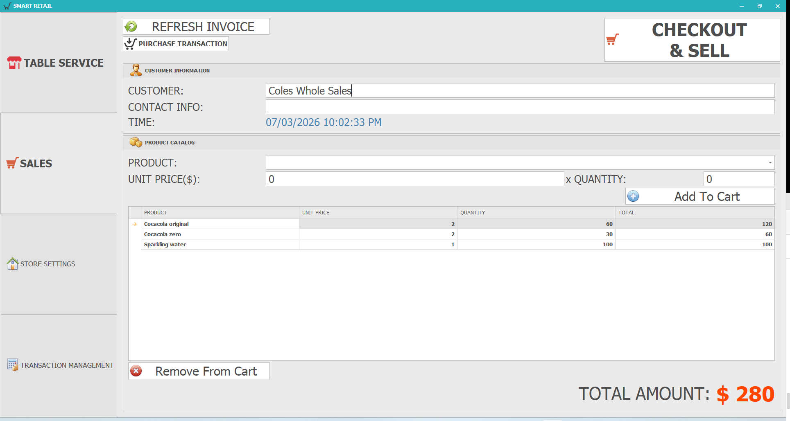

*Sales tab: cart with multiple items ready for checkout.*

---

### Table service — Table and dine-in order management

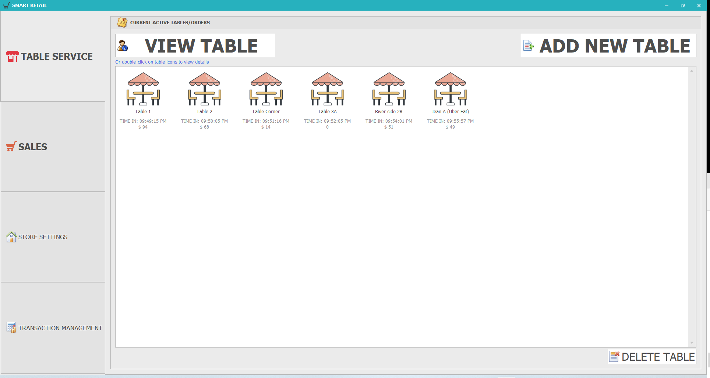

*Table management: active tables list, time, order value.*

---

### Store settings — Shop, products & income/expense

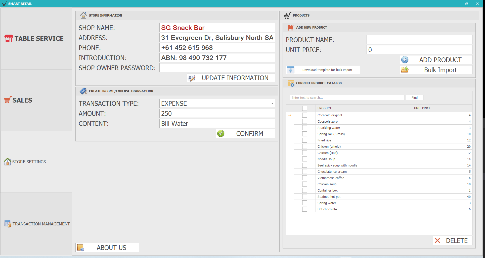

*Store setup: shop info, create income/expense transactions, product catalog.*

---

### Transaction management — Time-based statistics

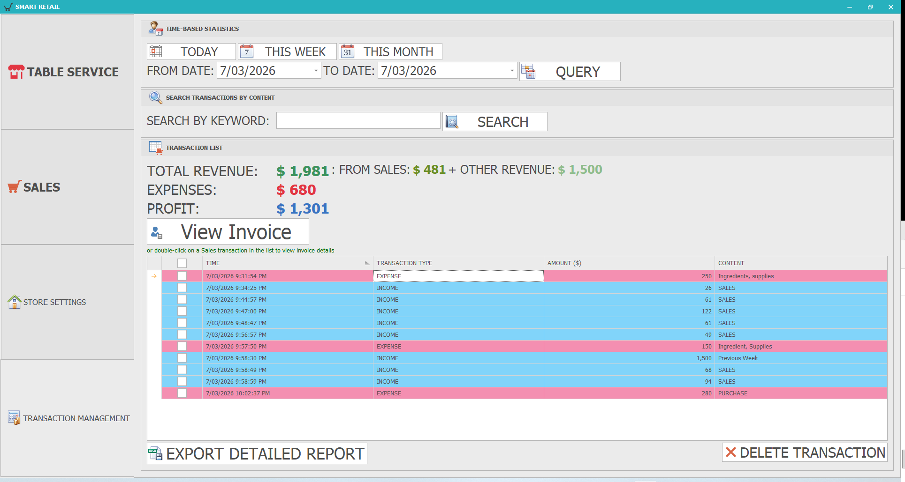

*Transaction management: filter by day/week/month, total revenue, expenses, profit and transaction list.*

---

### Invoice — Print invoice (DevExpress XtraReports)

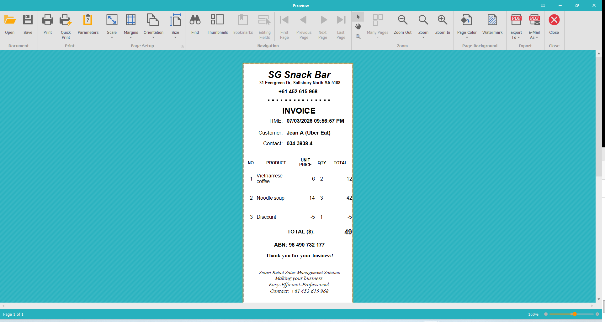

*Preview and print invoice: shop info, customer, product details, total amount.*

---

### Export Excel — Financial & sales reports

**Financial summary report (Financial Report):**

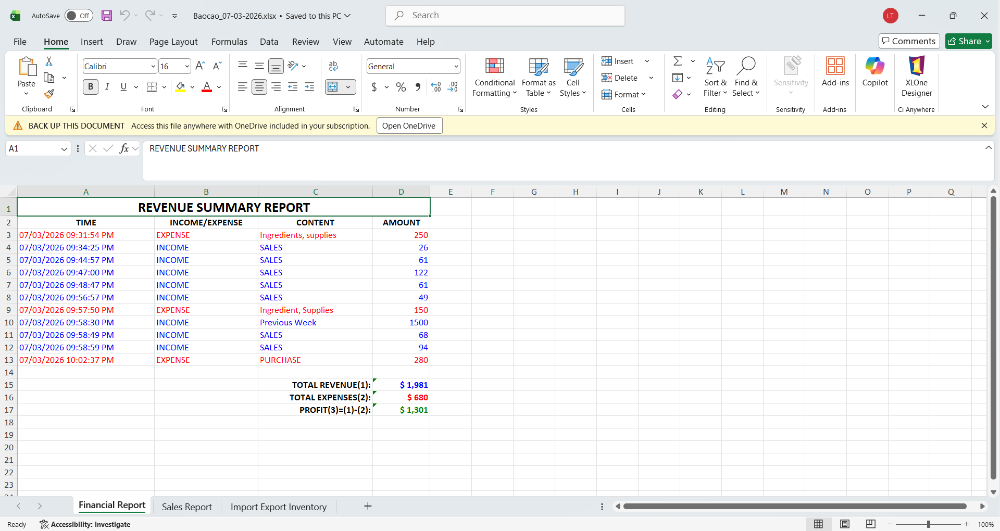

**Detailed product sales report (Sales Report):**

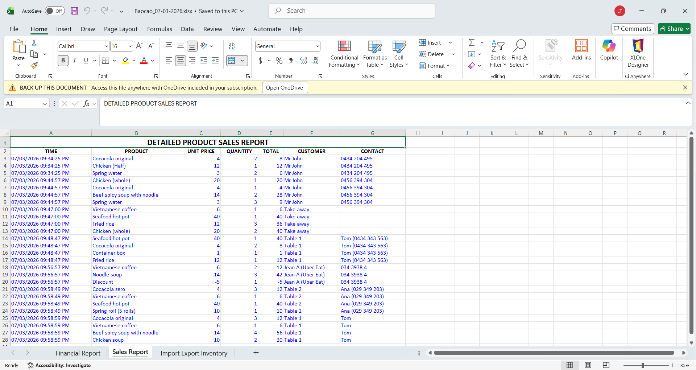

**Inventory / import-export report (Import Export Inventory):**

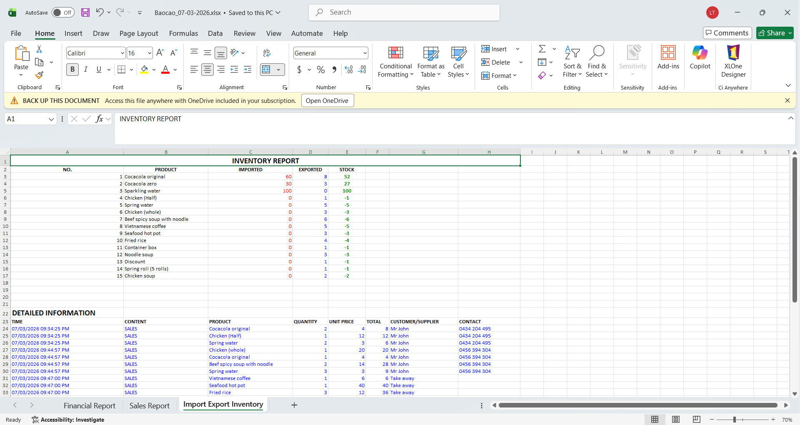

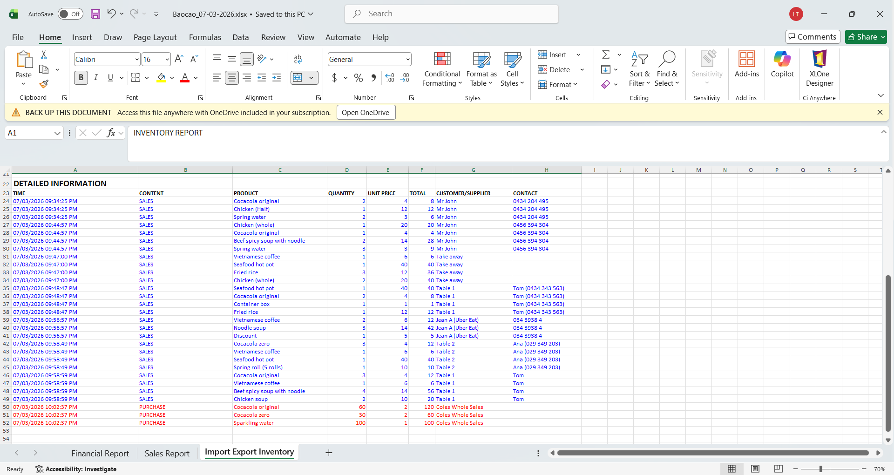

---

### About Us

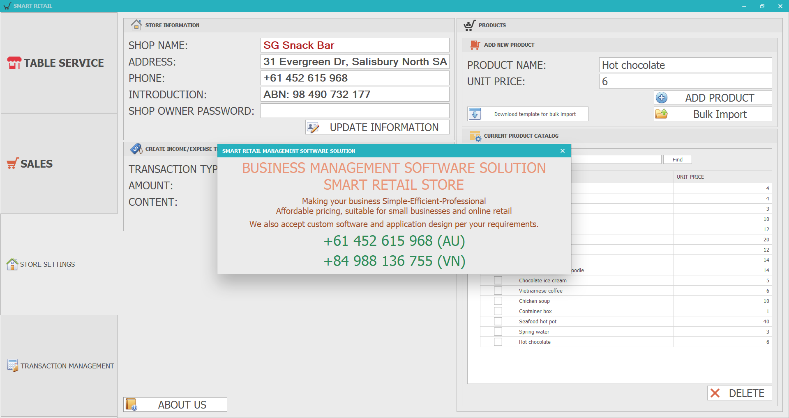

*About screen: software info and contact details.*

---

*This project demonstrates desktop development with C#, WinForms, DevExpress, Excel-based persistence, and reporting — suitable for portfolio/CV as a small business retail management system.*
